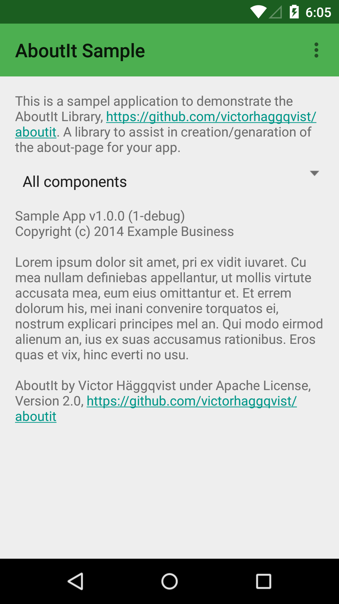
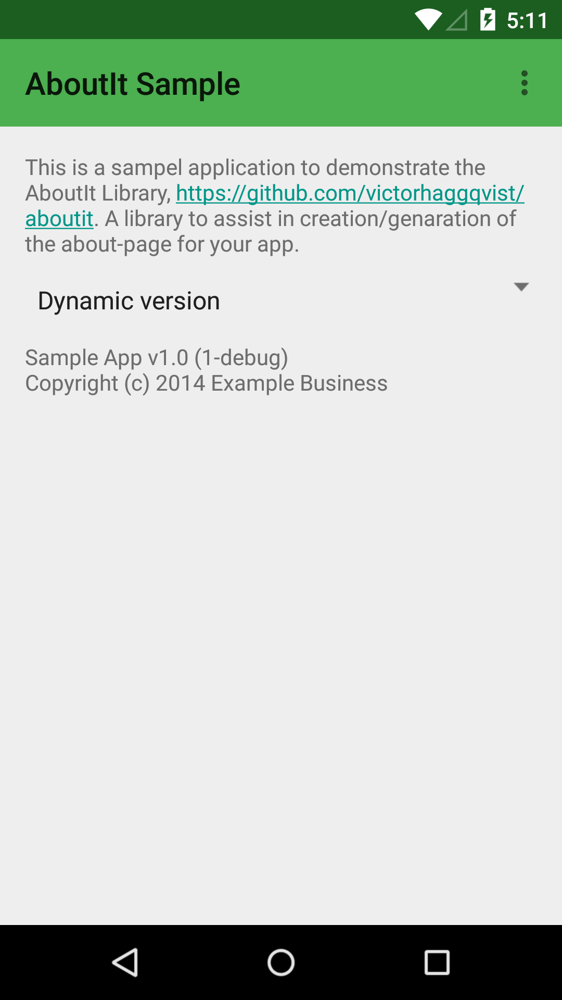
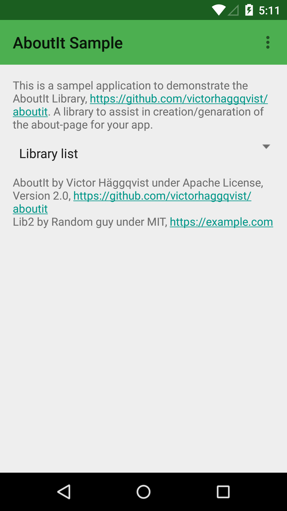
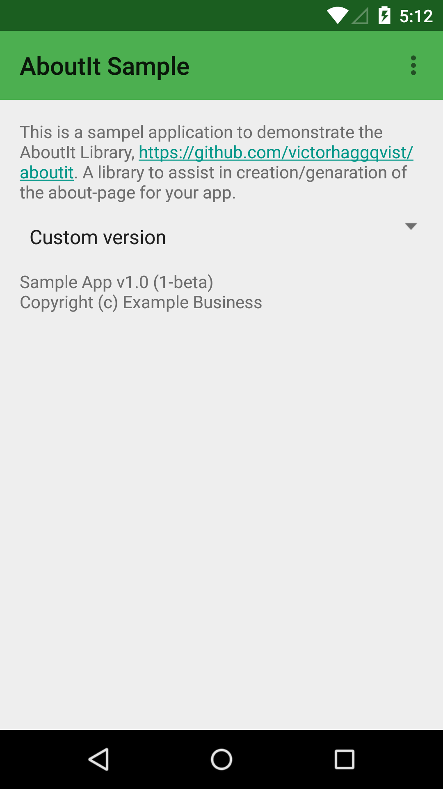

# AboutIt
A About-page creator

## Install
From Maven Central [](http://mvnrepository.com/artifact/com.snilius.aboutit/aboutit)

    implementation 'com.snilius.aboutit:aboutit:1.2.2'

Optionally one may also add the meta module to get some common library presets for free, like Retrofit, Gson, OkHttp, Glide and some more.
Current version: [](http://mvnrepository.com/artifact/com.snilius.aboutit/aboutit-meta)

    implementation 'com.snilius.aboutit:aboutit-meta:1.0.1'

## Sample
A complete sample
```java
new AboutIt(this).app(R.string.app_name)
    .buildInfo(BuildConfig.DEBUG, BuildConfig.VERSION_CODE, BuildConfig.VERSION_NAME)
    .copyright("Example Business")
    .libLicense("AboutIt", "Victor Häggqvist", L.AP2, "https://github.com/victorhaggqvist/aboutit")
    .libLicense(new LibTimber()) // requires aboutit-meta module
    .toTextView(R.id.about_text);
```

Just the dynamic version name and copyright year display
```java
new AboutIt(this).app("My App")
        .buildInfo(BuildConfig.DEBUG, BuildConfig.VERSION_CODE, BuildConfig.VERSION_NAME)
        .copyright("Example Business")
        .toTextView(R.id.about_text);
```

The code for these samples are all in the sample app [here](aboutit-sample/src/main/java/com/snilius/aboutit/sample/MainActivity.java).






## License

    Copyright 2014-2018 Victor Häggqvist

    Licensed under the Apache License, Version 2.0 (the "License");
    you may not use this file except in compliance with the License.
    You may obtain a copy of the License at

       http://www.apache.org/licenses/LICENSE-2.0

    Unless required by applicable law or agreed to in writing, software
    distributed under the License is distributed on an "AS IS" BASIS,
    WITHOUT WARRANTIES OR CONDITIONS OF ANY KIND, either express or implied.
    See the License for the specific language governing permissions and
    limitations under the License.
